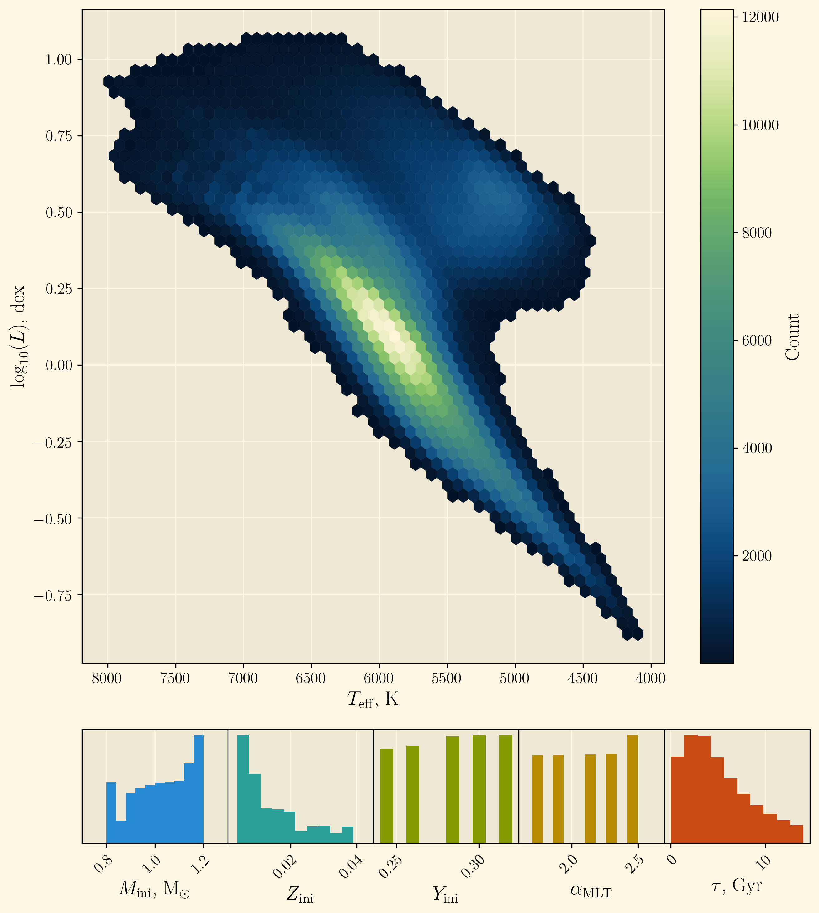
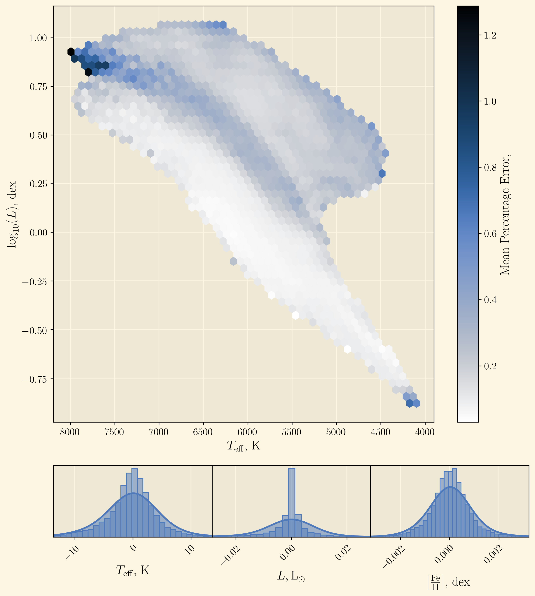
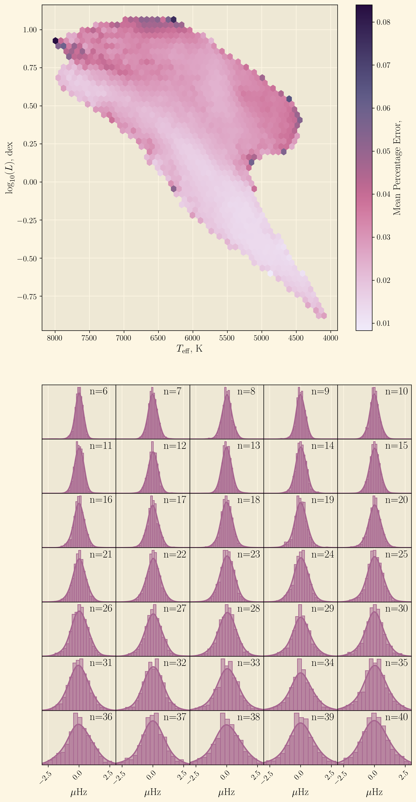

# pitchfork
*rapid emulation of individual radial modes of solar like oscillators using a branching neural network*
---
Accurately measuring the ages and internal structures of stars is tough!

We can use individual asteroseismic modes of oscillation to improve precision, but typically this comes at a hefty computational cost when interpolating grids to high dimenstions.

In this repo we present *pitchfork* - a branching multilayer perceptron capable of rapidly emulating the indivudual radial modes of a grid of solar-like oscillators.

For the remainder of this README, I'll briefly present the relevant info regarding the training data for pitchfork and our prediction accuracy on a test set.

Then, we can take a look at the `inference-example.ipynb` notebook to go over our process of stellar parameter inference.

Hope you enjoy!

See the supporting publication here:
- arXiv: *url here*
- MNRAS: *url here*

## training data
Let's take a look at the data used to train *pitchfork*.

We use the grid of solar-like oscillators described in Lyttle et al. 2021[^Lyttle_2021], which I recommend checking out if you want more details. In fact, I recommend checking it out in general - it's a great paper!

[^Lyttle_2021]: Lyttle, Alexander J., et al. “Hierarchically Modelling Kepler Dwarfs and Subgiants to Improve Inference of Stellar Properties with Asteroseismology.” \mnras, vol. 505, no. 2, Aug. 2021, pp. 2427–46, https://doi.org/10.1093/mnras/stab1368.

Without going into too much detail, the stellar models were generated using MESA **REF**, and the asteroseismic terms were generated with GYRE **REF**.

This means we supply inputs (stellar fundamental properties) of **M, T, Zini, Yini, and MLT** and end up with outputs (observables) **L, Fe/H, Teff** (the *classical* obserables), and a host of individual radial modes of radial orders **$6<n<40$** (the *classical* observables) for each of these models.

Because we are trying to emulate the behaviour of the stellar evolution codes, we use these inputs and outputs for *pitchfork* too.

The grid contains **X** tracks for a total of **X** stellar models, for which we set aside 5% for both the testing and validation sets.

A summary plot of the input distributions is shown below:

***Top:*** *hexbin plot showing counts of model grid points across the HR-diagram.* ***Bottom:*** *distributions of model input parameters used.*

This dataset is split with a 90/5/5 training/validation/test split. The training and validation data are used during training the network, and the unseen test is used purely for testing network precision and reporting results, which I'll show in the next section.

## pitchfork performance
We use the set aside test data from the training set to test the emulator's precision on the outputs.

Feast your eyes on some pretty plots that show *pitchfork*'s precision varies across the trained parameter space in the HR domain:

pitchfork *prediction precision for the classical observables.* ***Top:*** *hexbin plot showing mean percentage error averaged across the classical observables over the HR-diagram.* ***Bottom:*** *distributions of test set residuals for each classical observable.*

pitchfork *prediction precision for the asteroseismic observables.* ***Top:*** *hexbin plot showing mean percentage error averaged across all individual mode frequencies (radial orders $(6\leq n\leq40)$) over the HR-diagram.* ***Bottom:*** *distributions of test set residuals on each individual mode frequency, with radial order indicated in the top right.*

For each of the outputs, we take the median absolute deviation of the residual distribution over the test set as the quoted "precision" of *pitchfork*. While the plots above demonstrate the *pitchfork* prediction precision remains fairly consistent over the HR diagram, we do note that these quoted precisions are summary statistics only, and not valid on a point-by-point basis - this is something we aim to fix in future work :)

If you're interested, here's a table of *pitchfork* prediction precision metrics for all of the trained outputs:

| Parameter | $\sigma$ | $\sigma_\text{per cent}$ |
| --------- | -------- | ------------------------ |
| **Teff** | $5.893 \text{K}$ | $0.059$ |
| **L** | $0.014 \text{L}_{\odot}$ | $0.213$ |
| **Fe/H** | $0.001 \text{dex}$ | $0.578$ |
| $\nu_{n=6}$ | $0.316 \mu\text{Hz}$ | $0.035$ |
| $\nu_{n=7}$ | $0.368 \mu\text{Hz}$ | $0.036$ |
| $\nu_{n=8}$ | $0.381 \mu\text{Hz}$ | $0.032$ |
| $\nu_{n=9}$ | $0.345 \mu\text{Hz}$ | $0.027$ |
| $\nu_{n=10}$ | $0.380 \mu\text{Hz}$ | $0.027$ |
| $\nu_{n=11}$ | $0.360 \mu\text{Hz}$ | $0.023$ |
| $\nu_{n=12}$ | $0.379 \mu\text{Hz}$ | $0.023$ |
| $\nu_{n=13}$ | $0.383 \mu\text{Hz}$ | $0.021$ |
| $\nu_{n=14}$ | $0.409 \mu\text{Hz}$ | $0.021$ |
| $\nu_{n=15}$ | $0.411 \mu\text{Hz}$ | $0.020$ |
| $\nu_{n=16}$ | $0.432 \mu\text{Hz}$ | $0.020$ |
| $\nu_{n=17}$ | $0.441 \mu\text{Hz}$ | $0.019$ |
| $\nu_{n=18}$ | $0.465 \mu\text{Hz}$ | $0.019$ |
| $\nu_{n=19}$ | $0.483 \mu\text{Hz}$ | $0.018$ |
| $\nu_{n=20}$ | $0.489 \mu\text{Hz}$ | $0.018$ |
| $\nu_{n=21}$ | $0.520 \mu\text{Hz}$ | $0.018$ |
| $\nu_{n=22}$ | $0.549 \mu\text{Hz}$ | $0.019$ |
| $\nu_{n=23}$ | $0.565 \mu\text{Hz}$ | $0.019$ |
| $\nu_{n=24}$ | $0.584 \mu\text{Hz}$ | $0.019$ |
| $\nu_{n=25}$ | $0.618 \mu\text{Hz}$ | $0.019$ |
| $\nu_{n=26}$ | $0.657 \mu\text{Hz}$ | $0.020$ |
| $\nu_{n=27}$ | $0.653 \mu\text{Hz}$ | $0.019$ |
| $\nu_{n=28}$ | $0.708 \mu\text{Hz}$ | $0.020$ |
| $\nu_{n=29}$ | $0.720 \mu\text{Hz}$ | $0.019$ |
| $\nu_{n=30}$ | $0.743 \mu\text{Hz}$ | $0.019$ |
| $\nu_{n=31}$ | $0.811 \mu\text{Hz}$ | $0.020$ |
| $\nu_{n=32}$ | $0.802 \mu\text{Hz}$ | $0.019$ |
| $\nu_{n=33}$ | $0.890 \mu\text{Hz}$ | $0.020$ |
| $\nu_{n=34}$ | $0.910 \mu\text{Hz}$ | $0.019$ |
| $\nu_{n=35}$ | $0.930 \mu\text{Hz}$ | $0.019$ |
| $\nu_{n=36}$ | $1.039 \mu\text{Hz}$ | $0.020$ |
| $\nu_{n=37}$ | $0.977 \mu\text{Hz}$ | $0.018$ |
| $\nu_{n=38}$ | $1.070 \mu\text{Hz}$ | $0.020$ |
| $\nu_{n=39}$ | $1.062 \mu\text{Hz}$ | $0.019$ |
| $\nu_{n=40}$ | $1.123 \mu\text{Hz}$ | $0.020$ |

