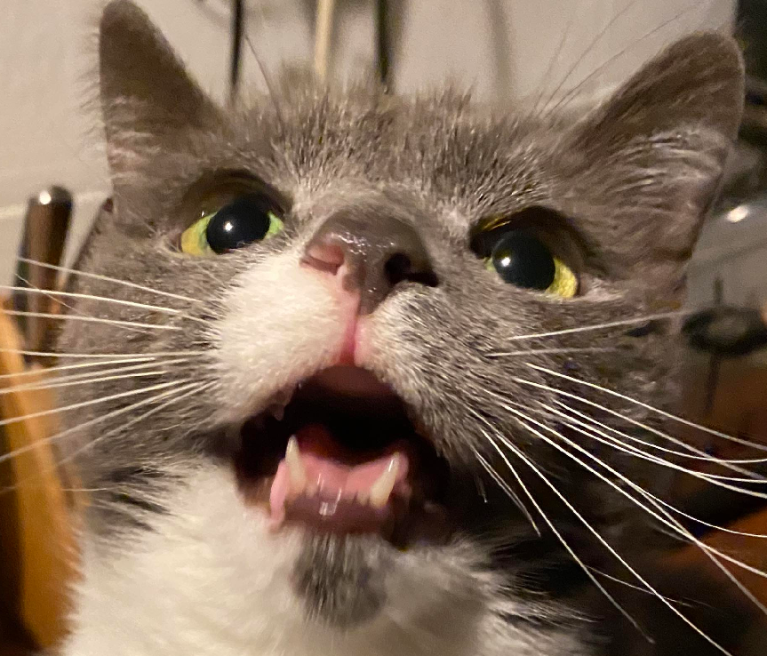

# pitchfork
*inferring fundamental properties of solar-like oscillators using a branching neural network emulator of a grid of stellar models*
---
Accurately measuring the ages and internal structures of stars is tough!

We can use individual asteroseismic modes of oscillation to improve precision, but typically this comes at a hefty computational cost when interpolating grids to high dimenstions.

In this repo we present `pitchfork` - a branching multilayer perceptron capable of rapidly emulating the indivudual radial modes of a grid of solar-like oscillators.

We also show examples of how we can use `pitchfork` as a rapid and efficient likelihood estimator during Bayesian inference of stellar fundamental properties using [`UltraNest`](https://github.com/JohannesBuchner/UltraNest)

Tutorial notebooks should be done in this order:
- `0-make-star-dict.ipynb`
- `1-simple-inference.ipynb`
- `2-custom-inference.ipynb`
- `3-using-pitchfork.ipynb`

`0-make-star-dict.ipynb` is for learning how to make your own data work with the sampler (it's very simple!) but you can skip straight to `1-simple-inference.ipynb` if you just want to see the sampler in action.

With the notebooks here, you should be able to go from stellar observables to fully marginalised, well-sampled posteriors of solar-like oscillators in minutes with just your laptop :)

If `pitchfork` is useful to your work, please cite the supporting publication found here:
- !INSERT PAPER LINK WHEN PUBLISHED!

## requirements:
- [`UltraNest`](https://github.com/JohannesBuchner/UltraNest), and dependencies
- [`tinygp`](https://github.com/dfm/tinygp), and dependencies
- [`scipy`](https://github.com/scipy/scipy), and dependencies

## map of the repo:
```
├── README.md
├── 0-make-star-dict.ipynb # learn how to load in data in a pitchfork-friendly way
├── 1-simple-inference.ipynb # learn how to run simple inference on the Sun
├── 2-custom-inference.ipynb # learn how to customise inference for your own stars
├── 3-using-pitchfork.ipynb # bonus stuff that pitchfork can do!
├── figs
│ └── ... # figures used in .md files
├── pitchfork
│ ├── pitchfork_info.md # further information on pitchfork for nerds
│ ├── pitchfork.json # dict of network weights, biases, and hyperparams saved using wtf
│ ├── pitchfork_covariance.txt # covariance matrix of neural network residuals used in likelihood
│ └── pitchfork_info.json # pitchork trained range and custom layer info that isn't stored in wtf dict
├── scripts
│ ├── ___init___.py
│ ├── compile_from_dict.py # wtf dict compilation
│ ├── pitchfork_compile.py # fully compile pitchfork with custom layers
│ ├── pitchfork_sampler.py # initialise sampler
│ └── utils.py # useful functions, mostly for plotting
├── stars
│ ├── 16CygA
│ │ └── 16CygA.json # star observable data
│ ├── 16CygB
│ │ └── 16CygB.json # star observable data
│ ├── Sun
│ │ └── Sun.json # observable data
│ └── TEMPLATE
│   └── TEMPLATE.json # template star dict - do not edit!
├── LICENSE
└── .gitignore
```

## picture of my cat:

